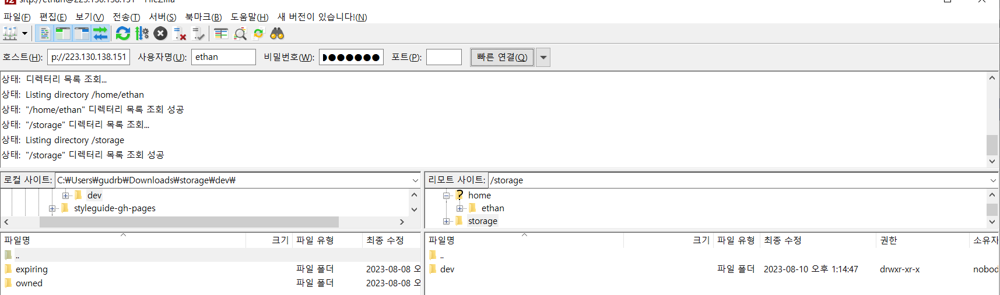
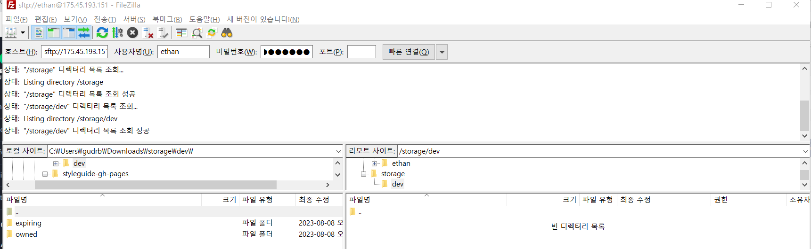
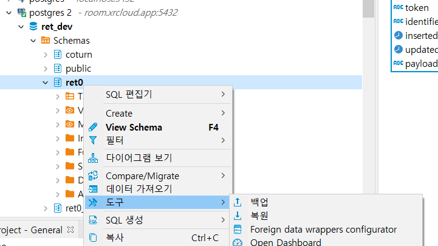
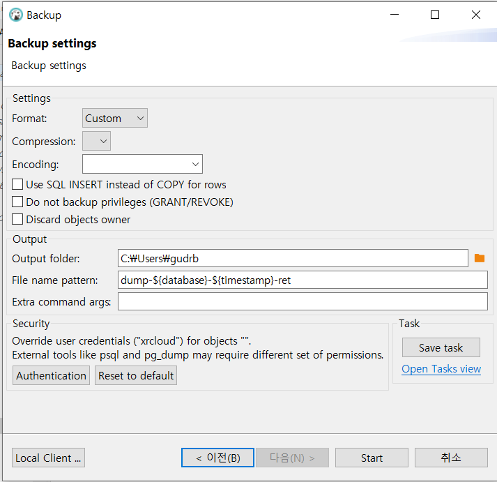
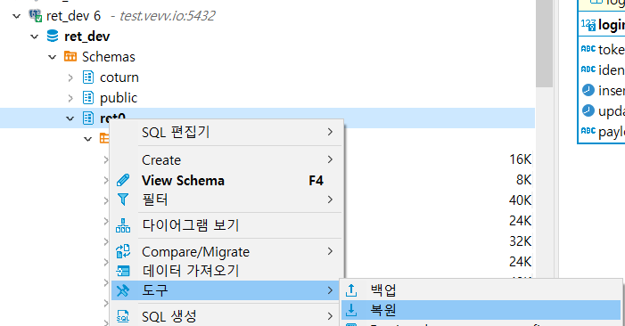

# hubs-all-in-one

mozilla hubs를 단일 호스트에서 실행하는 예제

릴리즈 빌드
- hubs

사용하지 않음
- thumbnail - 돌아갈 것 같기는 한데 서비스들이 호출하지 않는다.


## 요구사항

1. ssl 인증서나 도메인 등 설정이 변경되면 .env를 변경해야 한다.
1. ssl 인증서는 체인 인증서(중간 인증서)를 포함하는 unified.crt 인증서를 사용해야 한다.
1. 도메인과 ssl 인증서\
    hosts에 도메인을 등록해서 설정하는 것은 까다롭고 프록시 서버 설정에서 문제가 있기 때문에 여기서는 사용하지 않는다.
1. perms 키 생성\
    reticulum과 postgrest에서 사용하는 인증서를 생성해야 한다.
    ```sh
    sh certs/keygen/run.sh
    ```
1. ssl인증서의 기간이 남아있는지 검증해야 한다.\
    ```sh
    sh certs/check_cert_expiration.sh
    ```

## 설정
1. .env 변경
1. postgrest/postgrest.conf db설정 변경해야 한다.
1. reticulum-ex/dev.exs에서 5,6번째 라인 수정
    ```
    host = "hubs1.vevv.io"
    cors_proxy_host = "proxy1.vevv.io"
    ```
1. nginx.conf 20번째 라인
    ```
    server_name proxy1.vevv.io;
    ```

## 빌드

요구사항을 모두 갖추면 다음의 순서로 스크립트를 실행한다.
`빌드 결과물은 모두 docker image다`

1. dialog 이미지 생성
    ```sh
    sh dialog-ex/build.sh
    ```
1. postgrest 이미지 생성
    ```sh
    sh postgrest/build.sh
    ```
1. hubs 이미지 생성
    ```sh
    sh hubs-ex/build.sh
    ```
1. reticulum 이미지 생성
    ```sh
    sh reticulum-ex/build.sh
    ```


## 실행
여러 프로젝트를 동시에 실행하면 `ENOSPC: System limit for number of file watchers reached`에러가 발생할 수 있다.
리눅스라면 아래와 같이 설정한다.
```sh
echo fs.inotify.max_user_watches=524288 | sudo tee -a /etc/sysctl.conf && sudo sysctl -p
```

1. sh db/run.sh
1. sh dialog-ex/run.sh
1. sh hubs-ex/run-admin.sh
1. sh hubs-ex/run-front.sh
1. sh postgrest/run.sh
1. sh reticulum-ex/run.sh
1. sh proxy/run.sh

## 실행 후
1. db에서 isAdmin = true
    > `docker exec db psql -U postgres -d ret_dev -c "UPDATE accounts SET is_admin = true;"`


## 참고
- https://github.com/albirrkarim/mozilla-hubs-installation-detailed


# NCLOUD에서 셋팅하는 방법(NAS 사용)
1.네이버 클라우드에서 xrcloud haio용 server를 생성한다.

2.NCLOUD에서 사용하기위해서 DB NAS, 레티큘럼 Storage용 NAS를 미리 만들어 준다.


3.GlobalDNS에서 레코드를 추가해준다.


4.아래와 같이 ACG를 설정해준다.


5.SSH접속 후 유저를 만들고 sudo권한을 준 후 사용자를 변경한다.
 ```sh
   sudo adduser [사용자명]
   sudo usermod -aG sudo [사용자명]
   sudo su -[사용자명]
 ```

6.git을 설치한다.
```sh
    sudo apt-get update
    sudo apt-get install git
```
7.docker를 설치한다.
```sh
    sudo apt-get update &&
    sudo apt-get install apt-transport-https ca-certificates curl gnupg-agent software-properties-common &&
    curl -fsSL https://download.docker.com/linux/ubuntu/gpg | sudo apt-key add - &&
    sudo add-apt-repository "deb [arch=amd64] https://download.docker.com/linux/ubuntu $(lsb_release -cs) stable" &&
    sudo apt-get install docker-ce docker-ce-cli containerd.io &&
    sudo usermod -aG docker ${USER} &&
    sudo service docker restart
```
8.세션(터미널)을 다시 시작한다. \
docker ps가 권한 오류가 날 경우 세션을 재시작하거나 root로 바꾼 후 다시 접속한다.

```sh
    sudo -su root
    sudo -su [사용자명]
```
9.hubs-all-in-one을 다운 받는다.
```sh
    git clone https://github.com/belivvr/hubs-all-in-one.git
```

10.env.sh에서 만든 NAS 정보를 넣어 준다.
```sh
    ...
    DB_VOLUME_DIR="/data/postgres"
    DB_NAS_LOCATION="169.254.84.53:/n3048487_testNasDB"
    RETICULUM_STORAGE_DIR="/storage"
    STORAGE_NAS_LOCATION="169.254.84.53:/n3048487_testStorage"
    ...
```
11.NAS를 적용할 경우 prod 옵션을 추가해서 reset_all을 실행 시킨다.
```sh
    bash reset_all.sh prod
```

12.`dev_team@belivvr.com`을 가입하고 admin으로 만들어야 한다.
```

docker exec -it db psql -U postgres -d ret_dev

update accounts set is_admin = true;

```

## 백업

1. storage 백업

    ```sh
    #ssh에서
    sudo tar -czvf storage.tar.gz /storage
    #sftp에서
    get storage.tar.gz /Users/hunjuly/Downloads/storage.tar.gz
    ```

2. db 백업
    ```sh
    #ssh에서
    docker run --rm  -v ./db_backup:/work -e PGPASSWORD=????  postgres:11-bullseye pg_dump -U xrcloud -h room.xrcloud.app ret_dev -b -f /work/backup.sql
    #sftp에서
    get backup.sql /Users/hunjuly/Downloads
    ```

3. storage 복원
    ```sh
    #sftp에서
    put /Users/hunjuly/Downloads/storage.tar.gz storage.tar.gz
    #ssh에서
    tar -xzvf storage.tar.gz -C /
    ```

4. db 복원
    ```sh
    #sftp에서
    put /Users/hunjuly/Downloads/backup.sql backup.sql

    #ssh에서
    #backup.sql파일을 컨테이너 접근 가능 폴더로 이동
    #mv backup.sql /data/postgres/
    # 복원
    #docker exec db psql -U postgres ret_dev -f /var/lib/postgresql/data/backup.sql
    # 검사
    #docker exec -it db psql -U postgres -d ret_dev

    ```

### 에단이 작성한 백업 방법
참고.
FTP 서버 설치하여 NAS 데이터 이전
```sh
sudo apt install pure-ftpd
sudo service pure-ftpd start
```

/storage 디렉토리에서 데이터 백업



/storage 디렉토리에 백업한 데이터 복구



DB 데이터 덤프 및 복구(DBeaver 툴 사용) \
\
1.데이터 백업 \




2.데이터 복구 \


주의. 외래키 때문에 한번에 복구가 안될 수 있어서 두번 정도 데이터를 복구해야함.

## TODO
Spoke nginx로 실행
reticulum release실행
